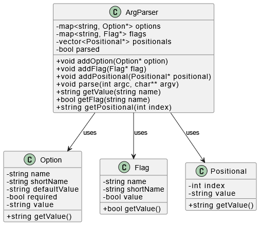

# Аргумент-парсер на C++

Эта программа реализует простую, но гибкую библиотеку для парсинга аргументов командной строки на языке C++ с использованием объектно-ориентированного подхода. Она позволяет удобно работать с опциями, флагами и позиционными аргументами.

## Возможности

- Поддержка именованных опций с обязательным или необязательным значением.
- Поддержка булевых флагов (`--verbose`, `--debug`, и т.д.).
- Поддержка позиционных аргументов в нужном порядке.
- Обработка аргументов `argc` / `argv` в одном вызове.
- Доступ к значению любого аргумента по имени или индексу.
- Гибкое добавление новых типов аргументов при необходимости.
- Разделение логики по отдельным классам — легко расширять и тестировать.

## Структура классов

На диаграмме ниже показаны основные классы, их поля и связи между ними:



## Пример использования

```cpp
#include "ArgParser.h"

int main(int argc, char** argv) {
    ArgParser parser;
    parser.addOption(new Option("input", "default.txt", true));
    parser.addFlag(new Flag("verbose"));
    parser.addPositional(new Positional(0));

    parser.parse(argc, argv);

    std::string inputFile = parser.getValue("input");
    bool verbose = parser.getFlag("verbose");
    std::string command = parser.getPositional(0);

    // ... дальнейшая логика
}
```

## Структура проекта

```
/bin
  └── main.cpp           # Пример использования библиотеки
/lib
  ├── ArgParser.h/.cpp   # Основной интерфейс
  ├── Option.h/.cpp      # Класс для опций
  ├── Flag.h/.cpp        # Класс для флагов
  └── Positional.h/.cpp  # Класс для позиционных аргументов
/tests
  └── argparser_test.cpp # Юнит-тесты
/images
  └── classes.png        # Диаграмма классов
```

## Сборка и запуск

Для компиляции используйте любой компилятор, поддерживающий C++17 или выше:

```bash
g++ -std=c++17 bin/main.cpp lib/*.cpp -o argparser
./argparser --input data.txt run
```

## Лицензия

MIT