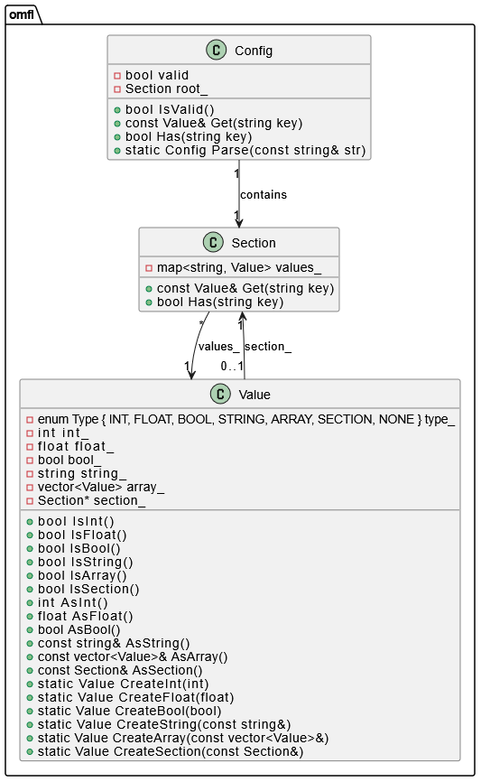

---

# Лабораторная работа 6

## OneMoreFunnyLanguage (OMFL)

**OMFL** — это собственный формат конфигурационных файлов, разработанный как более гибкая альтернатива `ini`. Он предоставляет удобный способ структурирования данных через ключи, значения, секции и подсекции, а также позволяет хранить данные различных типов, включая массивы и вложенные структуры.

---

## Особенности реализованного парсера

Был разработан полноценный парсер формата **OMFL**, поддерживающий:

- валидацию конфигурационного файла согласно спецификации;
- работу с типами данных: строки, целые и вещественные числа, булевы значения, массивы;
- логическую организацию данных в секции и вложенные секции;
- доступ к данным по ключу с сохранением структуры;
- поддержку комментариев и игнорирование пустых строк.

Интерфейс парсера позволяет обращаться к данным конфигурации через цепочки секций и ключей, а также проверять тип хранимого значения.

---

## Спецификация формата

Формат чувствителен к регистру. Поддерживает:

### Ключи и значения

```text
name = "M3100"
number = 123
temperature = -3.14
is_valid = true
```

Ключ состоит из латинских букв, цифр, символов `_` и `-`. Значения могут быть следующих типов:

- строка (`"..."`);
- целое число (`int32_t`);
- вещественное число (`double`);
- булевы значения (`true`, `false`);
- массив значений (`[1, "abc", false]`).

### Секции и вложенные секции

```text
[server]
host = "localhost"
port = 8080

[database.mysql]
user = "admin"
password = "1234"

[database.postgres]
enabled = true
```

Секции обозначаются квадратными скобками. Подсекции реализуются через точку.

### Массивы

Массивы могут содержать значения любых допустимых типов:

```text
numbers = [1, 2, 3.14, "text"]
flags = [true, false, true]
nested = [[1, 2], ["a", "b"], [true, false]]
```

### Комментарии

Поддерживаются однострочные комментарии:

```text
# This is a comment
key = "value"  # Inline comment
```

---

## Интерфейс парсера

Парсер реализует интерфейс, соответствующий тестам, и предоставляет:

- методы доступа к значениям по ключу;
- возможность получения секции;
- определение типа значения (целое, строка, массив и т.д.);
- проверку на существование ключей и секций;
- корректную обработку вложенных структур.

---

## Диаграмма классов

На схеме ниже показана архитектура проекта и взаимосвязи между основными компонентами парсера:



---

## Тестирование

Реализация проходит базовые тесты, включенные в директорию `tests`, а также была дополнительно протестирована пользовательскими сценариями для проверки:

- вложенности секций;
- смешанных массивов;
- граничных случаев парсинга чисел и строк;
- устойчивости к некорректным структурам и дублирующим ключам.

---

## Заключение

В результате выполненной работы был реализован стабильный и расширяемый парсер формата **OMFL**, пригодный для хранения и чтения конфигурационных данных различной сложности.