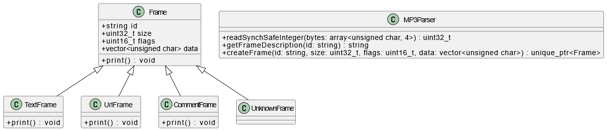

# MP3 ID3v2 Parser

Программа на C++ для чтения и отображения тегов ID3v2 из MP3-файлов. Поддерживает фреймы текста, URL, комментариев и обрабатывает неизвестные фреймы.

---

## 📦 Структура проекта

```bash
.
├── bin/
│   └── main.cpp             # Точка входа
├── lib/
│   ├── MP3Parser.h          # Заголовок с классами и функциями
│   └── MP3Parser.cpp        # Реализация классов
├── tests/
│   └── test_mp3parser.cpp   # Юнит-тесты (Google Test)
├── images/
│   └── classes.png          # Диаграмма классов
└── README.md
```

---

## 🔧 Сборка и запуск

### Требования

- CMake
- Компилятор с поддержкой C++17
- [Google Test](https://github.com/google/googletest)

### Сборка

```bash
mkdir build
cd build
cmake ..
make
```

### Запуск

```bash
./bin/mp3parser your_file.mp3
```

---

## 🧪 Тестирование

```bash
./tests/test_mp3parser
```

---

## 📚 Диаграмма классов



---

## 📄 Поддерживаемые фреймы

| ID     | Описание             |
|--------|----------------------|
| TIT2   | Название             |
| TPE1   | Исполнитель          |
| TALB   | Альбом               |
| TRCK   | Номер трека          |
| TYER   | Год                  |
| TDRC   | Дата релиза          |
| TCON   | Жанр                 |
| COMM   | Комментарий          |
| TENC   | Программа кодирования|
| TCOM   | Композитор           |
| TBPM   | Темп (BPM)           |
| TSSE   | Программа кодирования|
| TPOS   | Номер диска          |

---

## 📝 Автор

Разработано в рамках учебного проекта.
