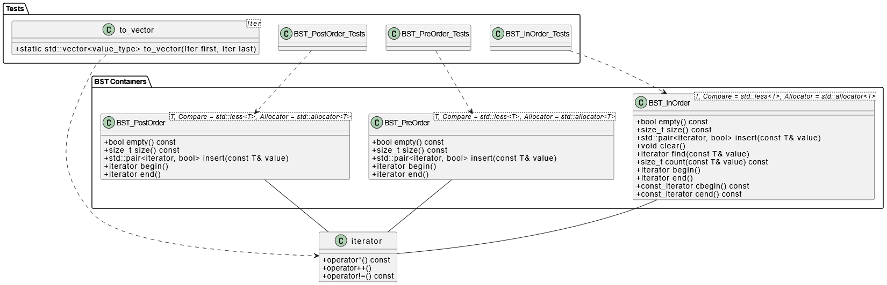

# Библиотека BST Containers

Этот проект предоставляет три шаблонных класса двоичных деревьев поиска (BST) с различными способами обхода:

- **`BST_InOrder<T, Compare, Allocator>`**  
  Обход «in-order» (симметричный). Элементы посещаются в порядке возрастания (или по заданному компаратору).

- **`BST_PreOrder<T, Compare, Allocator>`**  
  Обход «pre-order» (прямой). Сначала посещается узел, затем левое и правое поддеревья.

- **`BST_PostOrder<T, Compare, Allocator>`**  
  Обход «post-order» (обратный). Сначала левое и правое поддеревья, затем узел.

Каждый контейнер параметризуется:

- `T` — тип хранимых элементов.  
- `Compare` — функтор сравнения (по умолчанию `std::less<T>`).  
- `Allocator` — тип аллокатора (по умолчанию `std::allocator<T>`).

Все три контейнера удовлетворяют STL-требованиям:

- **Container**  
- **AssociativeContainer**  
- **ReversibleContainer** (для in-order и post-order)  
- **AllocatorAwareContainer**  
- **BidirectionalIterator**

Контейнеры предоставляют:

- Конструирование/деструктуру  
- `insert(const T&) → std::pair<iterator, bool>`  
- `find(const T&)`, `count(const T&)`  
- `size()`, `empty()`, `clear()`  
- Прямые итераторы: `begin()`, `end()`  
- Обратные итераторы: `rbegin()`, `rend()`

---

## Диаграмма классов

  
Схема отражает взаимосвязи между шаблонными классами BST и их вложенными итераторами.

## Запуск

- **`launch_main.bat`** / `./bin/main` — запускает демонстрационную программу.  
- **`launch_tests.bat`** / `ctest` — запускает набор тестов Google Test.

---

## Пример использования

```cpp
#include <iostream>
#include "BST_containers.h"

int main() {
    BST_InOrder<int>   bst_in;
    BST_PreOrder<int>  bst_pre;
    BST_PostOrder<int> bst_post;

    int a[] = { 5, 2, 8, 1, 3, 7, 9 };
    for(int v : a) {
        bst_in.insert(v);
        bst_pre.insert(v);
        bst_post.insert(v);
    }

    // In-order (отсортированный порядок)
    for(auto it = bst_in.begin(); it != bst_in.end(); ++it)
        std::cout << *it << ' ';
    std::cout << "\n";

    // Pre-order
    for(auto x : bst_pre)
        std::cout << x << ' ';
    std::cout << "\n";

    // Post-order
    for(auto x : bst_post)
        std::cout << x << ' ';
    std::cout << "\n";

    return 0;
}
```

---

## Тестирование

Юнит-тесты реализованы с помощью Google Test в файле `tests/test_bst_containers.cpp`. Они проверяют:

- Типовые требования и соответствие STL-контейнеру.  
- Базовые операции: `insert`, `find`, `count`, `clear`.  
- Корректность последовательностей обхода для in-, pre- и post-order.  
- Пограничные случаи: пустое дерево, копирование/присваивание, поиск отсутствующих элементов.

Запуск тестов:

```bash
cd build
ctest --output-on-failure
```
