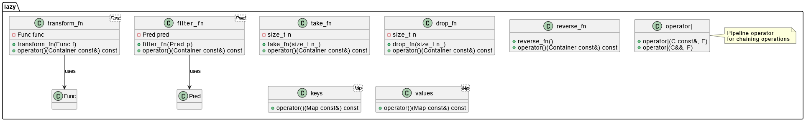

# Lazy Adapters Library

**Lazy Adapters** — это легковесная C++ библиотека для функционального и ленивого преобразования контейнеров с помощью удобного конвейерного синтаксиса (`|`).

Проект реализует адаптеры для обработки последовательностей в стиле функционального программирования, аналогично потокам в Unix-системах.

---

## Возможности

- **Функциональные адаптеры**:
  - `filter` — фильтрация элементов по предикату
  - `transform` — преобразование элементов
  - `take` — взять первые `N` элементов
  - `drop` — пропустить первые `N` элементов
  - `reverse` — реверсирование последовательности
  - `keys` — получить ключи ассоциативного контейнера
  - `values` — получить значения ассоциативного контейнера
- **Конвейерный синтаксис** (`|`) для построения цепочек преобразований.
- **Поддержка различных контейнеров** (`std::vector`, `std::list`, `std::map` и других).
- **Ленивые вычисления**: каждый адаптер работает с копиями, без изменения оригинала.

---

## Пример использования

```cpp
#include "lib/lazy_adapters.h"
#include <iostream>
#include <vector>

int main() {
    using namespace lazy;

    std::vector<int> v = {1, 2, 3, 4, 5, 6};

    for (int x : v 
         | filter([](int x) { return x % 2; })
         | transform([](int x) { return x * x; }))
    {
        std::cout << x << ' ';
    }
    std::cout << std::endl;
}
```

Вывод:

```
1 9 25
```

---

## Диаграмма классов

Диаграмма классов библиотеки:



---

## Сборка и тестирование

### Требования
- CMake >= 3.14
- Компилятор с поддержкой C++17
- Google Test Framework для тестирования

### Сборка

```bash
mkdir build
cd build
cmake ..
make
```

### Запуск тестов

```bash
./tests/tests_run
```

---

## Файловая структура проекта

```
.
├── CMakeLists.txt
├── bin/
│   ├── CMakeLists.txt
│   └── main.cpp
├── lib/
│   ├── CMakeLists.txt
│   ├── lazy_adapters.cpp
│   └── lazy_adapters.h
├── tests/
│   └── test_lazy_adapters.cpp
└── images/
    └── classes.png
```

---

## Лицензия

Проект распространяется под лицензией MIT.  
Свободно используйте и модифицируйте!

---

---

### Объяснения:
- Вставил **пример использования**.
- Аккуратно описал все адаптеры.
- Подключил **диаграмму классов** через `images/classes.png`.
- Описал инструкции по **сборке и тестированию**.
- Указал структуру проекта.
- Приложил **раздел лицензии** (MIT — как стандарт, если у тебя нет другого требования).

---
