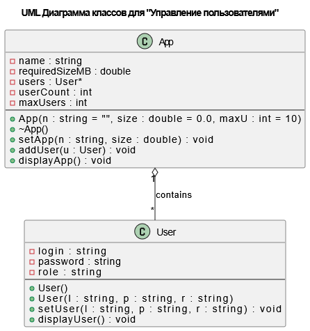
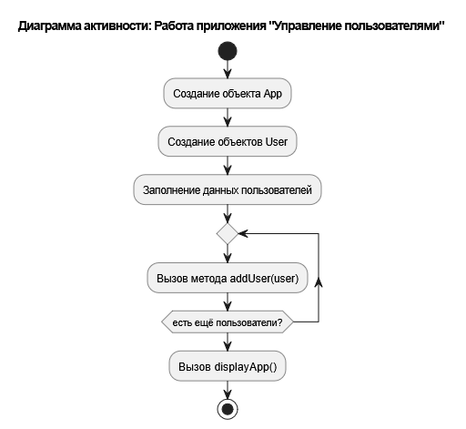

---


# 🔧 Лабораторная работа №1 по ООП (C++), варианту №9

## 📄 Описание

Данный проект посвящён основам **объектно-ориентированного программирования** на языке программирования C++. В ходе него были созданы классы для представления приложения и его пользователей и реализованы различные функции для добавления и отображения пользователей.

Возможности программы:
- ➕ Добавление новых пользователей в приложение;
- 📦 Сбор информации о приложении, пользователях и требуемом ими объёме памяти;
- 🖨️ Вывод информации на экран.

### 📐 UML-диаграмма классов


### 🔁 UML-диаграмма активности


## 🗂️ Структура проекта

│   .gitignore
│   CMakeLists.txt
│   LICENSE
│   README.md
│
├───.vscode
│       settings.json
│       tasks.json
│
├───build
├───images
│       activity.png
│       class.png
│
└───src
        App.cpp
        App.h
        User.cpp
        User.h
        main.cpp


## ⚙️ Сборка приложения на Windows:

1. Установите [MSYS2](https://www.msys2.org/), если он ещё не установлен.

2. Через терминал MSYS2 выполните установку `MinGW` и `CMake`:
   ```bash
   pacman -S --needed base-devel mingw-w64-ucrt-x86_64-toolchain
   pacman -S mingw-w64-ucrt-x86_64-cmake
   ```

3. После установки закройте MSYS2 и запустите `PowerShell` или `CMD`, чтобы проверить наличие инструментов:
   ```bash
   g++ --version
   gdb --version
   gcc --version
   cmake --version
   ```

4. Если всё настроено корректно, можно приступить к сборке проекта:

- Перейдите в каталог, содержащий `CMakeLists.txt`, и выполните:
  ```bash
  cmake -S . -B build -G "MinGW Makefiles"
  ```

- После генерации файлов сборки используйте:
  ```bash
  cmake --build build
  ```

- В каталоге появится исполняемый файл `Program.exe`, готовый к запуску.

**Важно**: чтобы избежать проблем с отображением кириллицы в консоли Windows, используйте `windows_demo.bat`. Этот файл запускает `Program.exe` с нужной кодировкой.

Дополнительно можно протестировать работу программы с примером, используя `windows_build_test.bat` и файл `RandomText.txt`.

## 🐧 Сборка и запуск на Linux:

Для Linux-систем процесс сборки проще и не требует установки MinGW.

Выполните в терминале:
```bash
cmake -S . -B build
cmake --build build
```

После сборки исполняемый файл будет доступен в каталоге `build`.

---

📚 **Полезные ссылки**:
- [Инструкция по запуску C++ проектов на Windows](https://github.com/adam-p/markdown-here/wiki/Markdown-Cheatsheet#links)
- [Инструкция по запуску C++ проектов на Linux](https://code.visualstudio.com/docs/cpp/config-linux)

---